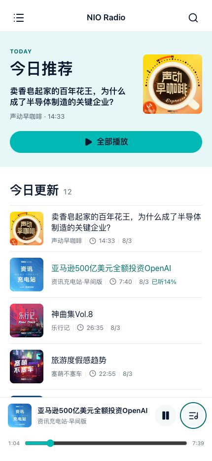
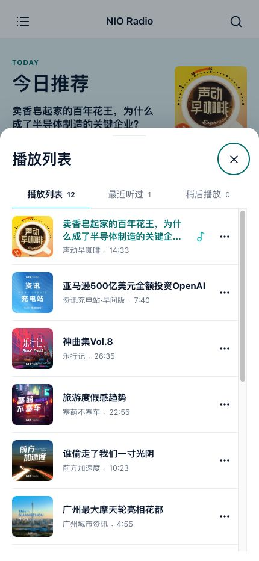

<div align="center">
  
  <h1>NIO Radio</h1>
  <p>面向手机与电脑浏览器的 NIO 播客 PWA，每日更新节目，并在本地保存你的播放进度。</p>
</div>

<table>
  <tr>
    <td width="50%"></td>
    <td width="50%"></td>
  </tr>
  <tr>
    <td align="center">今日更新</td>
    <td align="center">播放列表</td>
  </tr>
</table>

<p align="center"><strong><a href="https://nio.k4le.top/">立即体验 NIO Radio</a></strong></p>

## 主要功能

- 每日自动更新节目目录，并按最新节目时间展示专辑。
- 保存播放进度和最近听过的节目，重新打开后可以继续收听。
- 将任意节目加入“稍后播放”，在播放列表中统一管理。
- 支持电脑浏览器：宽屏下自动切换为桌面布局，提供侧边导航与常驻播放器。
- 支持添加到手机主屏幕，以接近原生应用的方式使用。

## 安装到主屏幕

- Android Chrome：打开 NIO Radio，在浏览器菜单中选择“安装应用”或“添加到主屏幕”。
- iPhone/iPad Safari：点击“分享”，然后选择“添加到主屏幕”。

## 开发与运维

NIO Radio 通过 GitHub Pages 发布，目录数据由 GitHub Actions 定时更新；所有播放进度、历史记录和“稍后播放”都保存在访问者自己的浏览器中。

## 本地开发

```bash
npm ci
npm run dev
```

提交前运行完整检查：

```bash
npm test
npm run lint
npm run build
```

`npm run preview` 可以在生产构建后启动本地预览，检查 PWA 资源和相对路径。

## 目录更新

目录生成器默认执行全量扫描：

```bash
npm run catalog
```

已有目录时，增量模式只刷新现有专辑：

```bash
NIO_CATALOG_MODE=incremental npm run catalog
```

全量模式用于发现新专辑：

```bash
NIO_CATALOG_MODE=full npm run catalog
```

全量扫描会保留请求失败的旧专辑；明确返回不存在的专辑才会删除。若结果比已有目录减少超过 10%，生成器会失败且不会写入 `public/data/albums.json`。目录写入使用临时文件和原子替换。

GitHub Actions 使用北京时间（`Asia/Shanghai`）：工作日 07:30 执行全量扫描，其余工作日时段执行增量扫描；周末在 12:00 和 18:00 执行增量扫描。工作流通过 `workflow_dispatch` 支持手动选择 `incremental` 或 `full`。

## GitHub Pages 发布

生产域名为 [nio.k4le.top](https://nio.k4le.top/)。`public/CNAME` 和相对资源路径保证自定义域名可用；旧地址 [icekale.github.io/nio-podcast-web](https://icekale.github.io/nio-podcast-web/) 由 GitHub Pages 管理重定向。

目录工作流只有在目录发生变化时才会提交 `public/data/albums.json` 到 `main`；提交成功后由独立的 Pages 工作流自动发布。部署失败时不要手动提交残缺目录，直接重新运行失败的工作流即可。

## 缓存策略

- 目录请求不进入 Service Worker 缓存；页面会在 5 分钟内复用 `localStorage` 目录，超过窗口再请求网络，失败时回退到最近目录。
- 目录同时保存在 `localStorage`，页面回到前台后最多每 5 分钟刷新一次。
- 专辑封面使用最多 700 张、30 天有效期的 `StaleWhileRevalidate` 缓存，旧图即时展示并在后台更新。
- 音频不进入 Service Worker 缓存，避免占用设备空间和缓存过期音频。
- 播放器状态使用 `nio_player_state_v2`，稍后播放使用 `nio_play_later_v1`。

## 故障恢复

1. 在 Actions 页面打开失败的 `Update NIO Radio catalog` 工作流，确认失败步骤和日志。
2. 网络或上游接口短暂异常时，重新运行相同模式；全量扫描保护会阻止残缺结果发布。
3. Pages 发布失败时，先修复工作流或 Pages 配置，再重新运行工作流；不要绕过测试直接推送目录。
4. 发布后检查自定义域名、旧地址、`manifest.webmanifest` 和 `data/albums.json` 是否返回成功响应。
