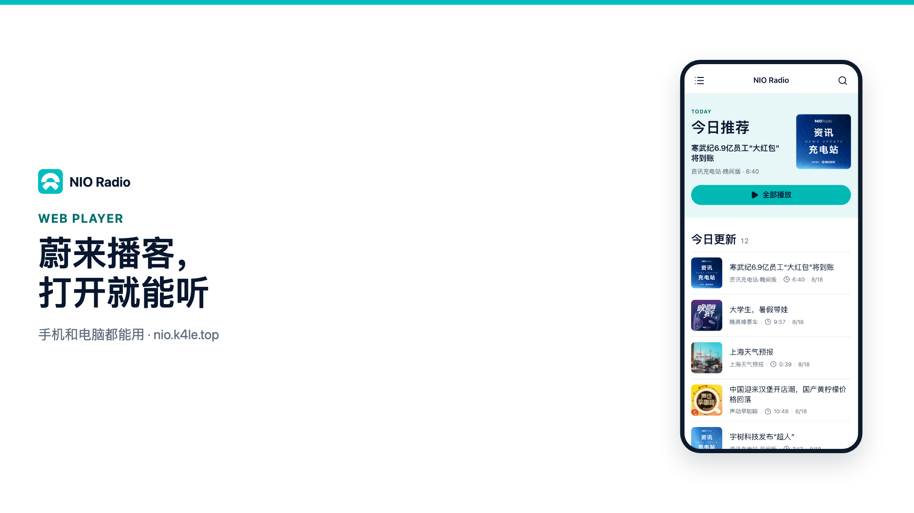

<p align="center"></p>

<p align="center"><strong><a href="https://nio.k4le.top/">立即体验 NIO Radio</a></strong></p>

<p align="center">
  <a href="https://vercel.com/new/clone?repository-url=https%3A%2F%2Fgithub.com%2Ficekale%2Fnio-podcast-web&project-name=nio-radio&repository-name=nio-podcast-web"></a>
  &nbsp;
  <a href="https://deploy.workers.cloudflare.com/?url=https://github.com/icekale/nio-podcast-web"></a>
</p>

## 一键部署

本仓库是纯静态 Vite PWA（`base: '/'`，History 路由），构建命令为 `npm run build`，输出目录为 `dist`。官方站点仍由 GitHub Pages 发布到 [nio.k4le.top](https://nio.k4le.top/)；也可以点上方按钮，用自己的账号再部署一份。旧的 `/#/album/23` 链接会自动跳到 `/album/23`。

### Vercel

点击 **Deploy with Vercel**，用 GitHub 登录后会克隆本仓库并自动识别 Vite。完成后得到 `*.vercel.app` 地址。之后只要绑定的仓库有新提交（包括目录更新），Vercel 会自动重建。

### Cloudflare

点击 **Deploy to Cloudflare**，用 Cloudflare 账号登录后会按仓库根目录的 `wrangler.toml` 构建，并把 `dist` 发布为 Workers 静态资源，完成后得到 `*.workers.dev` 地址。绑定同一仓库后，目录更新提交同样会触发重建。

## 主要功能

- 每日自动更新节目目录，并按最新节目时间展示专辑。
- 保存播放进度和最近听过的节目，重新打开后可以继续收听。
- 将任意节目加入“稍后播放”，在播放列表中统一管理。
- 支持电脑浏览器：宽屏下自动切换为桌面布局，提供侧边导航与常驻播放器。
- 支持添加到手机主屏幕，以接近原生应用的方式使用。

## 安装到主屏幕

- Android Chrome：打开 NIO Radio，在浏览器菜单中选择“安装应用”或“添加到主屏幕”。
- iPhone/iPad Safari：点击“分享”，然后选择“添加到主屏幕”。

## 开发与运维

NIO Radio 通过 GitHub Pages 发布，目录数据由 GitHub Actions 定时更新；所有播放进度、历史记录和“稍后播放”都保存在访问者自己的浏览器中。

## 本地开发

```bash
npm ci
npm run dev
```

提交前运行完整检查：

```bash
npm test
npm run lint
npm run build
```

`npm run preview` 可以在生产构建后启动本地预览，检查 PWA 资源和 History 路由回退。

## 目录更新

目录生成器默认执行全量扫描：

```bash
npm run catalog
```

已有目录时，增量模式只刷新现有专辑：

```bash
NIO_CATALOG_MODE=incremental npm run catalog
```

全量模式用于发现新专辑：

```bash
NIO_CATALOG_MODE=full npm run catalog
```

全量扫描会保留请求失败的旧专辑；明确返回不存在的专辑才会删除。若结果比已有目录减少超过 10%，生成器会失败且不会写入 `public/data/albums.json`。目录写入使用临时文件和原子替换。

GitHub Actions 使用北京时间（`Asia/Shanghai`）：每天 07:30 执行全量扫描；其余 02:00、17:00、17:30、18:00、19:00、20:00、21:00、24:00 执行增量扫描。工作流通过 `workflow_dispatch` 支持手动选择 `incremental` 或 `full`。

## GitHub Pages 发布

生产域名为 [nio.k4le.top](https://nio.k4le.top/)。推送 `main` 后，[Deploy NIO Radio to GitHub Pages](.github/workflows/deploy.yml) 会自动构建并发布。`public/CNAME` 和根路径资源保证自定义域名可用；构建会复制 `dist/404.html`，让 `/album/23` 这类 History 路由在 GitHub Pages 上也能打开。旧地址 [icekale.github.io/nio-podcast-web](https://icekale.github.io/nio-podcast-web/) 由 GitHub Pages 管理重定向。

目录工作流只有在目录发生变化时才会提交 `public/data/albums.json` 到 `main`。该提交使用 `GITHUB_TOKEN`，不会触发 `deploy.yml` 的 `on: push`，所以 catalog 工作流会再 `gh workflow run deploy.yml`。若目录已进 `main` 但 Pages 仍是旧包，到 Actions 手动运行 **Deploy NIO Radio to GitHub Pages**；不要指望重跑一次“目录无变化”的 catalog 工作流（第二次 attempt 才会补触发部署）。部署失败时不要手动提交残缺目录。

若要发布自己的 GitHub Pages 副本：Fork 本仓库，在 Settings → Pages 将 Source 设为 GitHub Actions，并启用 Actions。Fork 后请改掉 `public/CNAME`，避免占用生产自定义域名。

## 缓存策略

- 目录请求不进入 Service Worker 缓存；页面会在 5 分钟内复用 `localStorage` 目录，超过窗口再请求网络，失败时回退到最近目录。
- 目录同时保存在 `localStorage`，页面回到前台后最多每 5 分钟刷新一次。
- 专辑封面使用最多 700 张、30 天有效期的 `StaleWhileRevalidate` 缓存，旧图即时展示并在后台更新。
- 音频不进入 Service Worker 缓存，避免占用设备空间和缓存过期音频。
- 播放器状态使用 `nio_player_state_v2`，稍后播放使用 `nio_play_later_v1`。

## 故障恢复

1. 在 Actions 页面打开失败的 `Update NIO Radio catalog` 工作流，确认失败步骤和日志。
2. 网络或上游接口短暂异常时，重新运行相同模式；全量扫描保护会阻止残缺结果发布。
3. Pages 发布失败时，先修复工作流或 Pages 配置，再重新运行工作流；不要绕过测试直接推送目录。
4. 发布后检查自定义域名、旧地址、`manifest.webmanifest` 和 `data/albums.json` 是否返回成功响应。
